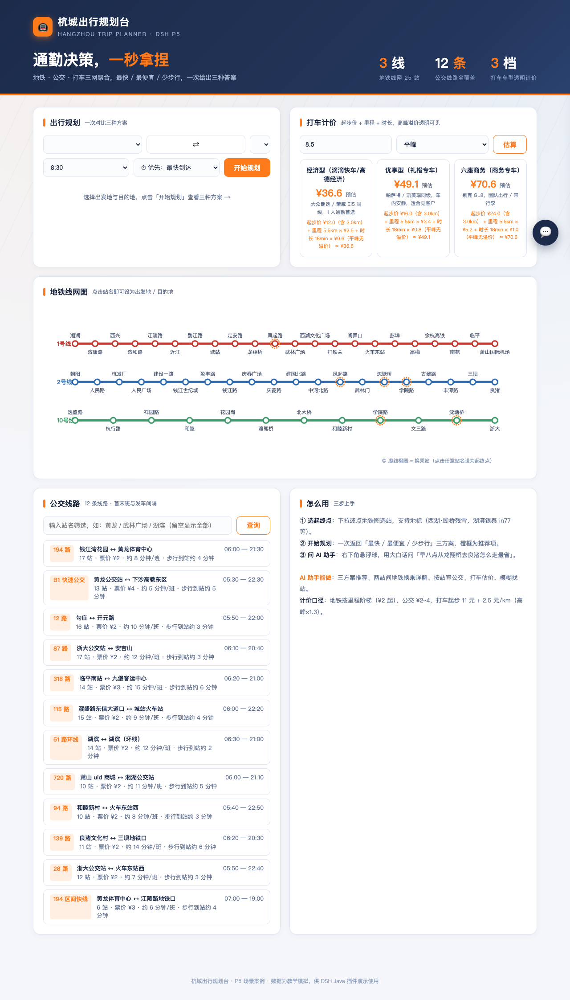
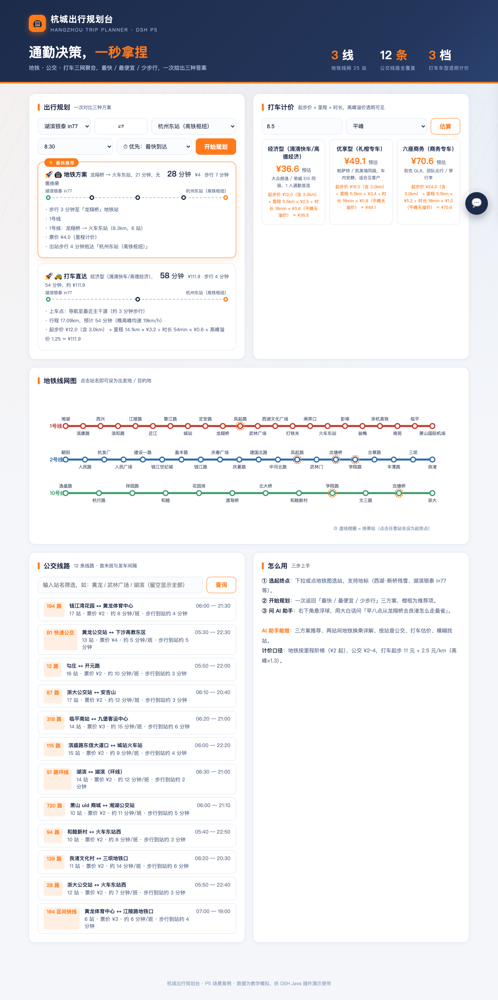
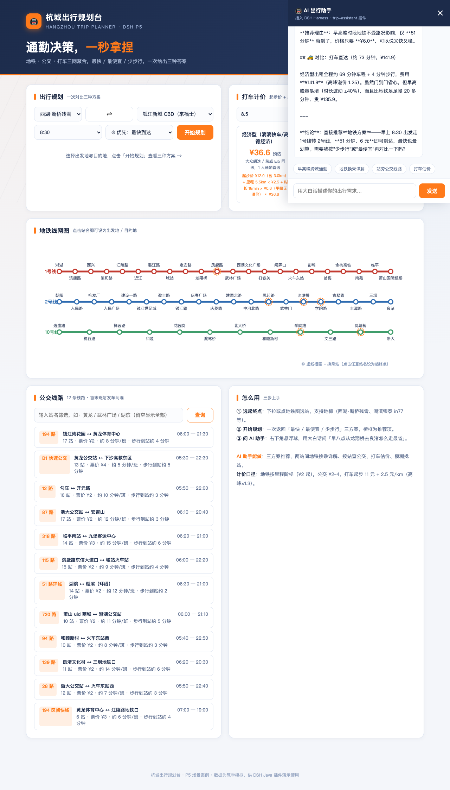
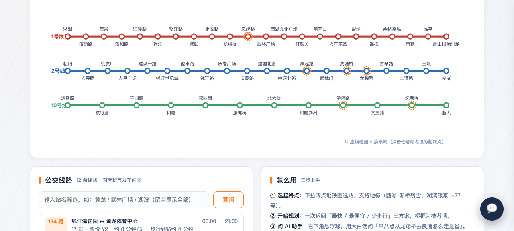

# 🚇 杭城出行规划台（P5 城市出行规划）

> 基于 [deepseek-harness-java（DSH）](https://github.com/deepseek-harness-java) 的 **Java Native Plugin** 场景案例：地铁 · 公交 · 打车三网聚合，一次给出「最快 / 最便宜 / 少步行」三种方案，AI 助手用大白话帮你做通勤决策。



## ✨ 核心功能

- **三方案聚合规划**：输入出发地 / 目的地，一次返回「最快 / 最便宜 / 少步行」三种方案，每种含总耗时、票价、步行时间与分步指引，橙框为推荐项
- **地铁换乘路径**：3 条线 25 站（真实杭州风格站名），Dijkstra 实时计算跨线换乘（凤起路 / 沈塘桥 / 学院路），里程阶梯票价
- **公交查询**：12 条线路，支持按站名查可乘线路、按线路名查完整站点与首末班
- **打车计价**：经济型 / 优享 / 六座商务三档，起步价 + 里程费 + 时长费，早晚高峰溢价透明可见
- **AI 出行助手**：页面右下角悬浮球，接入 DSH Harness，用「早八点从武林广场去良渚怎么走最省」这类大白话直接触发 5 个插件工具



## 🤖 DSH 插件：trip-assistant

插件 `trip-plugin` 以 **Java Native Plugin** 方式接入 DSH 宿主，把业务应用 REST API 注册为 5 个 Agent 工具（插件不直连数据，全部 HTTP 调用应用，守住安全边界）：

| 工具 | 类型 | 说明 |
|---|---|---|
| `plan_trip` | 读 | 核心：三方案聚合规划（最快/最便宜/少步行） |
| `metro_route` | 读 | 两站间地铁换乘路径（换乘站、耗时、票价） |
| `bus_query` | 读 | 双模式：按站查线路 / 按线路名查站点 |
| `taxi_estimate` | 读 | 打车费用估算（三档车型价格明细） |
| `station_search` | 读 | 站点/地标模糊定位（AI 先定位再规划） |

**端到端实测**（`agent_stream.sh` 真实工具调用轨迹）：



AI 回答中的数字与工具返回完全一致（如「51 分钟 ¥6.0」来自 `plan_trip` 的真实计算，非模型编造）。



## 🏗️ 项目结构

```
trip-planner/
├── trip-app/                  # Spring Boot 业务应用（端口 18081）
│   └── src/main/java/cn/xiaofuge/trip/app/
│       ├── TripStore.java         # 内存数据 + 规划引擎（地铁 Dijkstra/公交/打车）
│       ├── TripController.java    # REST API
│       ├── AssistantController.java # AI 面板 SSE 代理到 DSH /api/agent/stream
│       └── TripApplication.java
│   └── src/main/resources/static/index.html  # 单页前端（藏青 + 荧光橙设计语言）
├── trip-plugin/               # DSH Java Native 插件
│   ├── src/main/java/cn/xiaofuge/trip/plugin/TripPlugin.java
│   └── src/main/resources/
│       ├── META-INF/plugin.yaml          # 插件描述（id: trip-assistant）
│       └── META-INF/services/...         # SPI 注册文件
└── docs/screenshots/          # 验证截图
```

## 🚀 快速开始

### 前置

- JDK 17+
- [deepseek-harness-java](https://github.com/deepseek-harness-java) 运行中（默认 `http://127.0.0.1:8090`）

### 1. 构建并启动应用

```bash
mvn package -DskipTests
java -jar trip-app/target/trip-app-1.0.0-SNAPSHOT.jar --server.port=18081
# 打开 http://127.0.0.1:18081
```

### 2. 安装并激活插件

```bash
curl -X POST http://127.0.0.1:8090/api/harness/plugins/install \
  -H 'Content-Type: application/json' \
  -d '{"pluginId":"trip-assistant","displayName":"城市出行规划助手","pluginVersion":"1.0.0-SNAPSHOT","runtimeType":"JAVA_NATIVE","sourcePath":"'"$(pwd)"'/trip-plugin/target/trip-plugin-1.0.0-SNAPSHOT.jar","entrypoint":"trip-plugin-1.0.0-SNAPSHOT.jar"}'

curl -X POST http://127.0.0.1:8090/api/harness/plugins/activate \
  -H 'Content-Type: application/json' \
  -d '{"pluginId":"trip-assistant"}'
```

### 3. 验证

- 页面：`http://127.0.0.1:18081` 直接使用规划 / 地铁图 / 公交 / 打车
- AI：DSH 控制台对话，或页面右下角 AI 助手
- 命令行端到端：

```bash
curl -N -X POST http://127.0.0.1:8090/api/agent/stream \
  -H 'Content-Type: application/json' \
  -d '{"agentId":"trip-demo","approvalMode":"FULL_OPEN","message":"早八点从武林广场去良渚怎么走最快？"}'
```

📖 详细使用说明（含场景对话示例、常见问题）：[docs/使用说明.md](docs/使用说明.md)

## 📐 技术要点

- **规划引擎**：地铁用「(站, 线路)」状态空间 Dijkstra，边权 = 站间分钟 + 换乘 4 分钟；公交按「步行到站 + 候车 + 乘车 + 出站步行」合成；打车按「距离/均速 → 时长 → 起步 + 里程 + 时长 × 溢价」三档报价
- **数据细腻度**：预置 25 站真实里程、12 条公交线路含首末班/发车间隔/步行时间，全部数字由线网实时计算，AI 不允许编造
- **插件边界**：插件零业务逻辑，纯 HTTP 代理 + 参数校验；宿主重启不影响应用，应用重启不影响插件
- **内存数据**：重启即还原种子数据，适合演示与教学

## 📄 License

MIT
